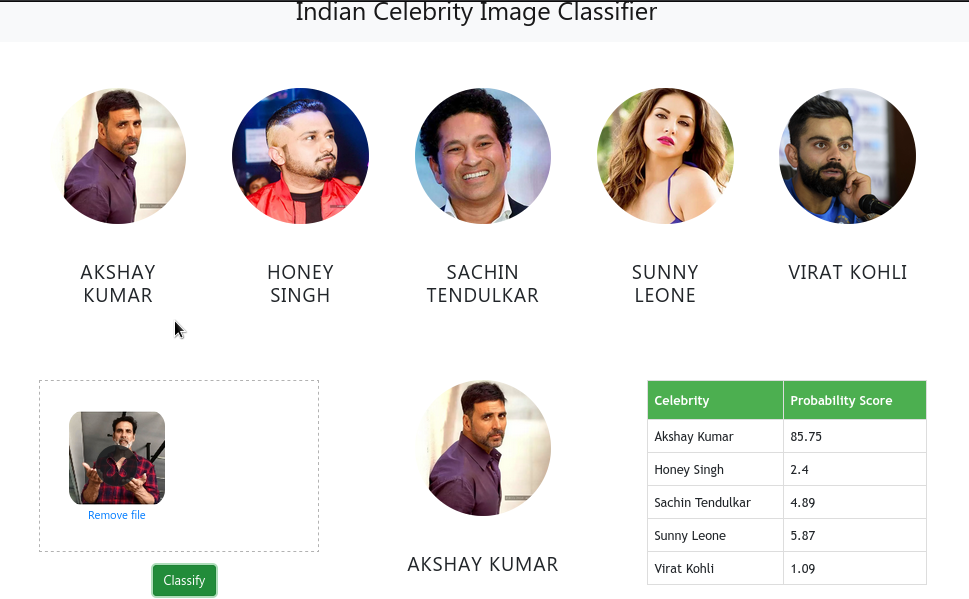

# Indian Celebrity Image Classifier

It is a Machine Learning Project on Image Classification Problem. I have built this project using `python flask server` for back-end and `HTML, CSS, JS` for front-end UI.
Basically it is a drag and drop UI. you can drag any pic and click on `clasify` button and the model will predict which celebrity's face the pic has. This model will predict the result for only these Indian celebrities.

1. Akshay Kumar
2. Honey Singh
3. Sachin Tendulkar
4. Sunny Leone
5. Virat Kohli

## UI

---

## Model

Used `opencv` for **Face Detection**.
I have used some classification models. below are the results of score of the models.
<table>
  <thead>
    <tr style="text-align:right">
      <th></th>
      <th>model</th>
      <th>best_score</th>
      <th>best_params</th>
    </tr>
  </thead>
  <tbody>
    <tr>
      <th>0</th>
      <td>svm</td>
      <td>0.741667</td>
      <td>{'svc__C': 1, 'svc__kernel': 'linear'}</td>
    </tr>
    <tr>
      <th>1</th>
      <td>random_forest</td>
      <td>0.606159</td>
      <td>{'randomforestclassifier__n_estimators': 10}</td>
    </tr>
    <tr>
      <th>2</th>
      <td>logistic_regression</td>
      <td>0.734058</td>
      <td>{'logisticregression__C': 10}</td>
    </tr>
  </tbody>
</table>

## Created by KUMAR SHANU
